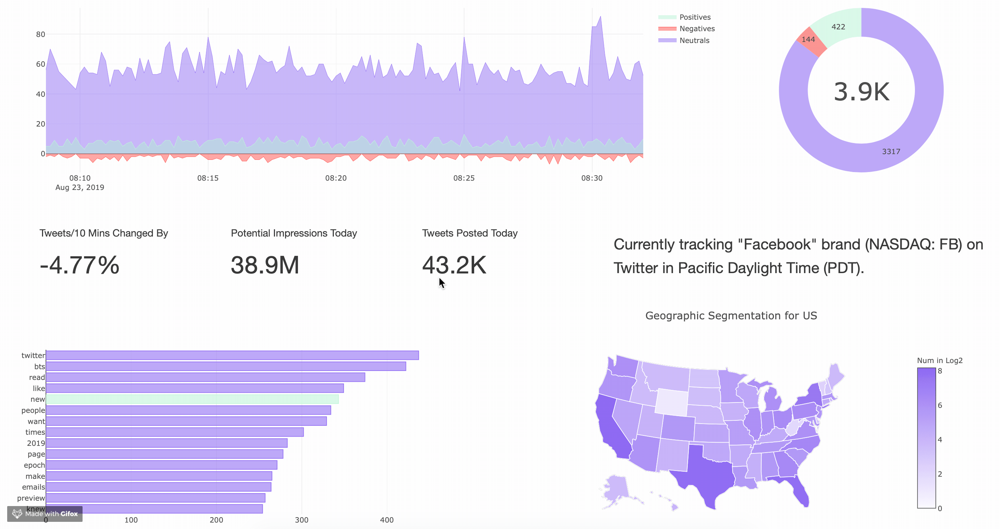

# Real-time Twitter Sentiment Analysis for Brand Improvement and Topic Tracking


[](https://twitter-analysis-web-app.herokuapp.com)
<br/>

__Dive into the industry and get my hands dirty. That's why I start this self-motivated independent project.__

Try this awesome __[Real-Time Twitter Monitoring System here](https://twitter-analysis-web-app.herokuapp.com)__ on Heroku server. Read a series of related articles below:

- [Chapter 1](http://bit.ly/2Zohn01): Collecting Twitter Data using Streaming Twitter API with Tweepy, MySQL, & Python
- [Chapter 2](http://bit.ly/2PzXG5M): Twitter Sentiment Analysis and Interactive Data Visualization using RE, TextBlob, NLTK, and Plotly
- [Chapter 3](http://bit.ly/2msOUbR): Deploy a Real-time Twitter Analytical Web App on Heroku using Dash & Plotly in Python
- Chapter 4 (In Progress): Parallelize Streaming Twitter Sentiment Analysis using Scala, Kafka and Spark Streaming

## Inspiration
The solution for evaluating Twitter data to perform better business decisions is to keep tracking all relevant Twitter content about a brand in real-time, perform analysis as topics or issues emerge, and detect anomaly with alert. By monitoring brand mentions on Twitter, brands could inform enagement and deliver better experiences for their customers across the world.

## Interesting facts from exploratory data analysis
- Less 0.01% users will push tweets with their locations.
- Tweets grabbed from streaming data won't have more than 0 LIKE or RETWEET, since you have already captured them even before others press buttons :p
- More than 65.6% users will write the locations in their profile, although very few of them don't live on Earth according to that fact.
- The numbers of positive and negative tweets are relatively close and stay low compared with neural tweet number. Unless emergency events happen, lines won't fluctuate acutely.

## Technical Approach - Version 2 ( ~ Sep 16)
1. Build ETL pipelines based on stream processing using Kafka (In Progress)
2. Perform sentiment analysis using Spark Streaming (In Progress)

## Orignal Development - Version 1.2 (Done🎉)
1. Extract streaming Twitter Data, preprocess data in Python, and load data into MySQL for storage
2. Perform exploratory data analysis with Pandas & Seaborn to explore the insights
3. Connect with Plotly for real-time interactive dashboard based on time series
4. Deploy the real-time interactive front-end web app using Dash & Heroku PostgreSQL on Heroku server

## Quick Demo 

### Real-time Interactive Web App on Heroku server
[web app](https://twitter-analysis-web-app.herokuapp.com) has been deployed on Heroku.


### Real-time Twitter Sentiment Analysis in Jupyter Notebook
Try this interactive [data visuilization](https://nbviewer.jupyter.org/github/Chulong-Li/Twitter-Data-Sentiment-Analysis/blob/master/Trend_Analysis_Complex.ipynb) in Jupyter Notebook. To run with streaming data, you need to deploy it locally.


## Get Started

### Pre-installation
```
pip install -r requirements.txt
```
### Set-up
Create a file called ```credentials.py``` and fill in the following content
```
# Go to http://apps.twitter.com and create an app.
# The consumer key and secret will be generated for you
API_KEY = "XXXXXXXXXXXXXX"
API_SECRET_KEY = "XXXXXXXXXXXXXXXXXXXXXXXXXXXXXXXXXXXXXXXXXXXXXXXXXX"

# After the step above, you will be redirected to your app's page.
# Create an access token under the the "Your access token" section
ACCESS_TOEKN = "XXXXXXXXXXXXXXXXXXXXXXXXXXXXXXXXXXXXXXXXXXXXXXXX"
ACCESS_TOKEN_SECRET = "XXXXXXXXXXXXXXXXXXXXXXXXXXXXXXXXXXXXXXXXXXX"
```

Create local MySQL database with info below
```
host="localhost"
user="root"
passwd="password"
database_table="TwitterDB"
```

### Track Word Setting (Optional)
You can change the ```TRACK_WORDS``` in ```settings.py``` into any word, brand, or topic you're interested.

### Stream the complex visualization
To perform streaming processing on dashboard, you need to deploy all settings above as well as let ```Main.ipynb``` keep listening.

### Run
Run ```Main.ipynb``` to start scraping data on Jupter Notebook. 

Run ```Analysis.ipynb``` to perform data analysis for brand improvement after ```Main.ipynb``` starts running.

Run ```Trend_Analysis_Complex``` to track topic trends on Twitter after ```Main.ipynb``` starts running.

Note: Since streaming process is always on, press STOP button to finsih.

## Dash Web Application
All things related to Dash App is placed in ```dash_app``` folder.


## Challenges
- Unstructured tweet texts may contain messy code and emoji characters
- Some brands may take a long time to collection enough data to perform analysis on issue emerging since they target specify groups of people
- Some hot words will uncover useful insights only after appearing more than 10k times on tweets
- Plotly doesn't have well-document on reference making customize dashboard much harder
- More challenges on the way, but Google, StackOverFlow, Towards Data Science, and GitHub will always be your best friends

